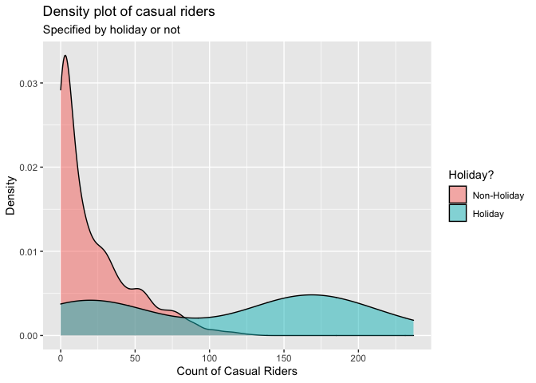

ST558 - Project 2
================
Group 5: Tyler Pollard & Lucy Yin

-   [Required Packages](#required-packages)
-   [Introduction](#introduction)
-   [Data](#data)
-   [Summarization](#summarization)
    -   [Contingency Tables](#contingency-tables)
        -   [Weather Situation](#weather-situation)
        -   [Year, Season and Count of
            Riders](#year-season-and-count-of-riders)
        -   [Working Day and Count of Casual
            Riders](#working-day-and-count-of-casual-riders)
    -   [Summary Tables](#summary-tables)
        -   [Feeling Temperature](#feeling-temperature)
        -   [Humidity](#humidity)
        -   [Wind Speed](#wind-speed)
    -   [Histograms](#histograms)
        -   [Humidity and Windspeed
            Distributions](#humidity-and-windspeed-distributions)
    -   [Density Plot](#density-plot)
        -   [Casual Riders and Weather
            Situation](#casual-riders-and-weather-situation)
        -   [Registered Riders and Weather
            Situation](#registered-riders-and-weather-situation)
        -   [Total Riders and Weather
            Situation](#total-riders-and-weather-situation)
        -   [Casual Riders and Holiday](#casual-riders-and-holiday)
        -   [Registered Riders and
            Holiday](#registered-riders-and-holiday)
        -   [Total Riders and Holiday](#total-riders-and-holiday)
    -   [Boxplots](#boxplots)
        -   [Feeling Temperature Over the
            Year](#feeling-temperature-over-the-year)
        -   [Riders of Every Hour and Weather
            Situation](#riders-of-every-hour-and-weather-situation)
    -   [Scatter Plots](#scatter-plots)
        -   [Count vs Casual by Season](#count-vs-casual-by-season)
        -   [Riders vs Temperature](#riders-vs-temperature)
        -   [Riders vs. Hour vs. Month vs. Working
            Day](#riders-vs-hour-vs-month-vs-working-day)
    -   [Correlation Plot](#correlation-plot)
        -   [Correlation between temp, atemp, hum,
            windspeed](#correlation-between-temp-atemp-hum-windspeed)
    -   [Plots with GGally](#plots-with-ggally)
        -   [Using Day Data](#using-day-data)
        -   [Using Hour Data](#using-hour-data)
-   [Modeling](#modeling)
    -   [Linear Regression Model](#linear-regression-model)
        -   [What is Linear Regression
            Model](#what-is-linear-regression-model)
        -   [Picking predictors using
            AIC](#picking-predictors-using-aic)
        -   [Modeling using AIC picked
            predictor](#modeling-using-aic-picked-predictor)
    -   [Ensemble Tree Model](#ensemble-tree-model)
        -   [Random Forest Model](#random-forest-model)
        -   [Boosted Tree Model](#boosted-tree-model)
-   [Comparison](#comparison)

# Required Packages

# Introduction

For this report we will be using 6 models (4 linear regression, 1 random
forest model, 1 boosted tree model) to make predictions on the total
count of bike riders using data from the Bike Sharing Dataset (dataset
can be found
[here](https://archive.ics.uci.edu/ml/datasets/Bike+Sharing+Dataset)).
This dataset contains hourly and daily count of registered, casual, and
total sum of riders in the Capital bikeshare system, contributing
variables include:

-   season (winter, spring, summer, fall)  
-   year (2011, 2012)  
-   month of the year
-   hour of the day  
-   holiday (yes, no)  
-   day of the week  
-   working day (yes or no)  
-   weather situation (mostly clear, mist, light precipitation, heavy
    precipitation)  
-   temperature  
-   feeling temperature  
-   humidity  
-   wind speed

There are 3 different types of response variables in the dataset:

-   registered: registered riders who uses this bikeshare service
    regularly  
-   casual: un-registered riders who use this service casually or on
    occasions  
-   total: combined count of registered and casual riders

For our analysis, we will be working with almost all of the variables as
predictors, and our response variable will be the total count of bike
riders.

We will be selecting predictors using the `step()` function which
chooses a model by AIC in a stepwise algorithm. As a result, which
predictors we incorporate in our linear regression models and ensemble
tree (specifically random forest and boosted tree) models may differ
depending on which day of the week we look at. We’ll randomly split the
data into training and test sets and fit the 6 models on the training
set. Ultimately we will fit the 6 models on the test set and decide on
which model produced the best prediction, which we judge by the smallest
root mean squared error value.

# Data

First we will read in both the `hours.csv` and `day.csv` data.

``` r
# read in data
hour.data <- read_csv("data/hour.csv") %>% as_tibble()
day.data <- read_csv("data/day.csv") %>% as_tibble()
```

We will make corrections on variable types, specifically we’re making
sure categorical variables will be appropriately classified as factors
with clear levels.

``` r
# correct the variable types
hour.data$season <- factor(hour.data$season)
levels(hour.data$season) <- list(winter = 1, spring = 2, summer = 3, fall = 4)

hour.data$yr <- factor(hour.data$yr)
levels(hour.data$yr) <- list("2011" = 0, "2012" = 1)

hour.data$weekday <- factor(hour.data$weekday)
levels(hour.data$weekday) <- list(monday = 1, tuesday = 2, wednesday = 3, thursday = 4, friday = 5, saturday = 6, sunday = 0)

hour.data$mnth <- factor(hour.data$mnth)
hour.data$hr <- factor(hour.data$hr)
hour.data$holiday <- factor(hour.data$holiday)
hour.data$workingday <- factor(hour.data$workingday)
hour.data$weathersit <- factor(hour.data$weathersit)

day.data$season <- factor(day.data$season)
levels(day.data$season) <- list(winter = 1, spring = 2, summer = 3, fall = 4)

day.data$yr <- factor(day.data$yr)
levels(day.data$yr) <- list("2011" = 0, "2012" = 1)

day.data$weekday <- factor(day.data$weekday)
levels(day.data$weekday) <- list(monday = 1, tuesday = 2, wednesday = 3, thursday = 4, friday = 5, saturday = 6, sunday = 0)

day.data$mnth <- factor(day.data$mnth)
day.data$holiday <- factor(day.data$holiday)
day.data$workingday <- factor(day.data$workingday)
day.data$weathersit <- factor(day.data$weathersit)
```

Because the variables temperature, feeling temperature, humidity and
windspeed are normalized according to different measures, we will
un-normalize them and save the raw values as separate columns in the
dataset.

``` r
# Temp Unnormal
temp.tmin = -8
temp.tmax = 39
hour.data$temp.unnormal <- hour.data$temp*(temp.tmax - temp.tmin) + temp.tmin # Unnormalize temp
hour.data$temp.F <- hour.data$temp.unnormal*(9/5) + 32 # Convert to Fahrenheit
day.data$temp.unnormal <- hour.data %>% group_by(dteday) %>% summarise(mean = mean(temp.unnormal)) %>% select(mean)
day.data$temp.unnormal <- day.data$temp.unnormal[[1]]
day.data$temp.F <- hour.data %>% group_by(dteday) %>% summarise(mean = mean(temp.F)) %>% select(mean)
day.data$temp.F <- day.data$temp.F[[1]]

# Atemp Unnormal
atemp.tmin = -16
atemp.tmax = 50
hour.data$atemp.unnormal <- hour.data$atemp*(atemp.tmax - atemp.tmin) + atemp.tmin # Unnormalize atemps
hour.data$atemp.F <- hour.data$atemp.unnormal*(9/5) + 32 # Convert to Fahrenheit
day.data$atemp.unnormal <- hour.data %>% group_by(dteday) %>% summarise(mean = mean(atemp.unnormal)) %>% select(mean)
day.data$atemp.unnormal <- day.data$atemp.unnormal[[1]]
day.data$atemp.F <- hour.data %>% group_by(dteday) %>% summarise(mean = mean(atemp.F)) %>% select(mean)
day.data$atemp.F <- day.data$atemp.F[[1]]

# Humidity Unnormal
day.data$hum.unnormal <- day.data$hum * 100
hour.data$hum.unnormal <- hour.data$hum * 100

# Windspeed Unnormal
day.data$windspeed.unnormal <- day.data$windspeed * 67
hour.data$windspeed.unnormal <- hour.data$windspeed * 67
```

Because hour and day data are stored separately, we create a
`total.data` table with all the information combined just in case we
need to access this in later steps.

``` r
# add in a new variable before merging
hour.data <- mutate(hour.data, type = "hour")
day.data <- mutate(day.data, type = "day", hr = NA) %>% select(instant, dteday, season, yr, mnth, hr, everything())

# merge to create complete list of hour/day data
total.data <- rbind(hour.data, day.data)
```

We will filter to only include data from one specific day of the week at
a time.

``` r
# filter out to one specific day of the week
hour.data <- hour.data %>% filter(weekday == params$weekday)
day.data <- day.data %>% filter(weekday == params$weekday)
total.data <- total.data %>% filter(weekday == params$weekday)
```

We randomly sample from the filtered data to form a training set (with
70% of data) and test set (with the remaining 30% of data). Here we
randomly sampled from the day dataset and split it into training and
test sets, then we split the corresponding data from the hours dataset
according to which days are in the training set and which days are in
the test set. We will be using the hours dataset for our modeling, but
we wanted to make sure our day and hour datasets had matching training
and test splits.

``` r
# splitting data into training & test sets
set.seed(7)
train <- sample(1:nrow(day.data), size = nrow(day.data)*0.7)
test <- dplyr::setdiff(1:nrow(day.data), train)
day.training.data <- day.data[train, ]
day.test.data <- day.data[test, ]

hour.training.data <- hour.data[hour.data$dteday %in% day.training.data$dteday,]
hour.test.data <- hour.data[hour.data$dteday %in% day.test.data$dteday,]
```

# Summarization

We have some basic summary statistics and plots about our training data.

## Contingency Tables

### Weather Situation

Below is a contingency table that shows the count of days that fall into
the different categories of weather situation. This table will help
justify the total count of riders because it can be expected that the
number of casual riders, which influences the total count of riders,
will be higher on nicer days that fall into the first two categories of
Mostly clear and Mist.

``` r
levels(day.training.data$weathersit) <- list(
  "Mostly clear" = "1",
  "Mist" = "2",
  "Light precipitation" = "3",
  "Heavy precipitation" = "4")
kable(t(table(day.training.data$weathersit)))
```

| Mostly clear | Mist | Light precipitation | Heavy precipitation |
|-------------:|-----:|--------------------:|--------------------:|
|           42 |   25 |                   5 |                   0 |

### Year, Season and Count of Riders

These contingency tables show what count range of riders utilized the
bikeshare service for a given season or for a given year. This table can
help us see if the number of riders increased/decreased from 2011 to
2012, or if season has an effect on how many riders used the bikeshare
service.

``` r
kable(table(day.training.data$season, cut(day.training.data$cnt, breaks = 2)), caption = "Occurrences of # Range of Riders of a given Season")
```

|        | (498,4.34e+03\] | (4.34e+03,8.18e+03\] |
|:-------|----------------:|---------------------:|
| winter |              13 |                    1 |
| spring |               6 |                   12 |
| summer |               3 |                   18 |
| fall   |               8 |                   11 |

Occurrences of # Range of Riders of a given Season

``` r
kable(table(day.training.data$yr, cut(day.training.data$cnt, breaks = 2)), caption = "Occurrences of # Range of Riders of a given Year")
```

|      | (498,4.34e+03\] | (4.34e+03,8.18e+03\] |
|:-----|----------------:|---------------------:|
| 2011 |              26 |                   10 |
| 2012 |               4 |                   32 |

Occurrences of # Range of Riders of a given Year

### Working Day and Count of Casual Riders

This contingency table show what count range of casual riders utilized
the bikeshare service on working day versus non-working day. Intuitively
we’d suspect that there would more casual riders on non-working day than
working day, this table can show us whether it’s true or not.

``` r
levels(day.training.data$workingday) <- list("workday" = 1, "non-workday" = 0)
kable(table(day.training.data$workingday, cut(day.training.data$casual, breaks = 2)), caption = "Occurrences of # Range of Casual Riders of Workday vs. non-Workday")
```

|             | (22.5,1.29e+03\] | (1.29e+03,2.56e+03\] |
|:------------|-----------------:|---------------------:|
| workday     |               70 |                    1 |
| non-workday |                0 |                    1 |

Occurrences of # Range of Casual Riders of Workday vs. non-Workday

## Summary Tables

### Feeling Temperature

The summary tables of feeling temperature show the 5 number summary
along with the mean and standard deviation of what the temperature
actually felt like over the different years. The summary table for both
the normalized and raw feeling temperatures are provided. These tables
give insight to the range of feeling temperatures felt by the riders for
the different years.

``` r
# Normalized feeling temperature
atemp.summary <- hour.training.data %>% group_by(yr) %>% summarise(Min. = min(atemp), `1st Qu.` = quantile(atemp,0.25), Median = median(atemp), Mean = mean(atemp), `3rd Qu.` = quantile(atemp, 0.75), Max. = max(atemp), `St. Dev.` = sd(atemp))
kable(atemp.summary, digits = 2, caption = "Summary of feeling temperatures by year")
```

| yr   | Min. | 1st Qu. | Median | Mean | 3rd Qu. | Max. | St. Dev. |
|:-----|-----:|--------:|-------:|-----:|--------:|-----:|---------:|
| 2011 | 0.08 |    0.33 |   0.49 | 0.48 |    0.64 | 0.88 |     0.18 |
| 2012 | 0.02 |    0.33 |   0.53 | 0.50 |    0.64 | 0.88 |     0.17 |

Summary of feeling temperatures by year

``` r
# Raw feeling temperature in Fahrenheit
atemp.summary.unnormal <- hour.training.data %>% group_by(yr) %>% summarise(Min. = min(atemp.F), `1st Qu.` = quantile(atemp.F,0.25), Median = median(atemp.F), Mean = mean(atemp.F), `3rd Qu.` = quantile(atemp.F, 0.75), Max. = max(atemp.F), `St. Dev.` = sd(atemp.F))
kable(atemp.summary.unnormal, digits = 2, caption = "Summary of raw feeling temperatures by year")
```

| yr   |  Min. | 1st Qu. | Median |  Mean | 3rd Qu. |  Max. | St. Dev. |
|:-----|------:|--------:|-------:|------:|--------:|------:|---------:|
| 2011 | 12.21 |    42.8 |   61.7 | 60.28 |    78.8 | 107.6 |    20.89 |
| 2012 |  5.01 |    42.8 |   66.2 | 62.58 |    78.8 | 107.6 |    20.14 |

Summary of raw feeling temperatures by year

### Humidity

These summary tables show the spread of normalized and raw humidity
values. The table includes the 5 number summary along with mean and
standard deviation, which gives insight to the range of humidity levels
riders experienced.

``` r
kable(t(c(summary(day.training.data$hum), St.Dev. = sd(day.training.data$hum))), digits = 2, caption = "Summary of Normalized Humidity")
```

| Min. | 1st Qu. | Median | Mean | 3rd Qu. | Max. | St.Dev. |
|-----:|--------:|-------:|-----:|--------:|-----:|--------:|
| 0.36 |    0.54 |   0.64 | 0.65 |    0.76 | 0.93 |    0.14 |

Summary of Normalized Humidity

``` r
kable(t(c(summary(day.training.data$hum.unnormal), St.Dev. = sd(day.training.data$hum.unnormal))), digits = 2, caption = "Summary of Raw Humidity")  
```

| Min. | 1st Qu. | Median |  Mean | 3rd Qu. | Max. | St.Dev. |
|-----:|--------:|-------:|------:|--------:|-----:|--------:|
|   36 |   53.79 |  63.85 | 64.81 |    75.8 |   93 |   14.44 |

Summary of Raw Humidity

### Wind Speed

These summary tables show the spread of normalized and raw wind speeds.
The table includes the 5 number summary along with mean and standard
deviation, which gives insight to the range of wind speeds riders
experienced.

``` r
kable(t(c(summary(day.training.data$windspeed), St.Dev. = sd(day.training.data$windspeed))), digits = 2, caption = "Summary of Normalized Wind Speed")
```

| Min. | 1st Qu. | Median | Mean | 3rd Qu. | Max. | St.Dev. |
|-----:|--------:|-------:|-----:|--------:|-----:|--------:|
| 0.06 |    0.14 |   0.18 | 0.19 |    0.24 | 0.35 |    0.07 |

Summary of Normalized Wind Speed

``` r
kable(t(c(summary(day.training.data$windspeed.unnormal), St.Dev. = sd(day.training.data$windspeed.unnormal))), digits = 2, caption = "Summary of Raw Wind Speed ")
```

| Min. | 1st Qu. | Median |  Mean | 3rd Qu. |  Max. | St.Dev. |
|-----:|--------:|-------:|------:|--------:|------:|--------:|
| 4.08 |    9.15 |  12.23 | 12.58 |   16.23 | 23.17 |    4.75 |

Summary of Raw Wind Speed

## Histograms

### Humidity and Windspeed Distributions

The following density plots show the distribution of the weather effects
for raw humidity and raw wind speed over the span of the biker data.
These distributions provide insight on what values for each weather
effect can be expected and how the combination of each effect may drive
the different weather situations and in turn the expected count of
riders.

``` r
hum.histogram <- ggplot(data = day.training.data, aes(x = hum.unnormal)) + 
  geom_histogram(aes(y = ..density..), bins = 30) + 
  geom_density(color = "red", size = 2) + 
  labs(title = "Humidity Distribution", x = "Raw Humidity", y = "Density")
windspeed.histogram <- ggplot(data = day.training.data, aes(x = windspeed.unnormal)) + 
  geom_histogram(aes(y = ..density..), bins = 30) + 
  geom_density(color = "red", size = 2) + 
  labs(title = "Windspeed Distribution", x = "Raw Windspeed", y = "Density")
grid.arrange(hum.histogram, windspeed.histogram, ncol = 2, top = "Density Distribution of Weather Effects")
```

<!-- -->

## Density Plot

### Casual Riders and Weather Situation

This density plot shows the amount of casual riders in a given weather
situation. Intuitively we suspect that there would more casual riders in
better weather conditions. This density plot can show us whether or not
this is true.

``` r
ggplot(hour.training.data, aes(x = casual)) + 
  geom_density(alpha = 0.5, aes(fill = weathersit)) + 
  labs(title = "Density plot of casual riders",
       subtitle = "Specified by weather situation",
       x = "Count of Casual Riders",
       y = "Density") + 
  scale_fill_discrete(name = "Weather Situation", labels = c("Mostly Clear", "Mist", "Light Precip.", "Heavy Precip."))  
```

<!-- -->

### Registered Riders and Weather Situation

This density plot shows the amount of registered riders in a given
weather situation. We suspect that the amount of registered riders
wouldn’t be as affected by weather situation as the amount of casual
riders would. This density plot can show us whether or not this is true.

``` r
ggplot(hour.training.data, aes(x = registered)) + 
  geom_density(alpha = 0.5, aes(fill = weathersit)) + 
  labs(title = "Density plot of casual riders",
       subtitle = "Specified by weather situation",
       x = "Count of Registered Riders",
       y = "Density") + 
  scale_fill_discrete(name = "Weather Situation", labels = c("Mostly Clear", "Mist", "Light Precip.", "Heavy Precip."))  
```

<!-- -->

### Total Riders and Weather Situation

This density plot shows the total count of riders in a given weather
situation. We may see a relationship between how many riders there are
and what type of weather condition it is.

``` r
ggplot(hour.training.data, aes(x = cnt)) + 
  geom_density(alpha = 0.5, aes(fill = weathersit)) + 
  labs(title = "Density plot of casual riders",
       subtitle = "Specified by weather situation",
       x = "Total Count of Riders",
       y = "Density") + 
  scale_fill_discrete(name = "Weather Situation", labels = c("Mostly Clear", "Mist", "Light Precip.", "Heavy Precip."))  
```

<!-- -->

### Casual Riders and Holiday

This density plot shows the amount of casual riders depending on whether
it is a holiday or non-holiday. We suspect there would be more casual
riders on holidays, especially at larger counts. This density plot can
show us whether that is true.

``` r
ggplot(hour.training.data, aes(x = casual)) + 
  geom_density(alpha = 0.5, aes(fill = holiday)) +
  labs(title = "Density plot of casual riders",
       subtitle = "Specified by holiday or not",
       x = "Count of Casual Riders",
       y = "Density") +
  scale_fill_discrete(name = "Holiday?", labels = c("Non-Holiday", "Holiday"))    
```

<!-- -->

### Registered Riders and Holiday

This density plot shows the amount of registered riders depending on
whether it is a holiday or non-holiday. We suspect there would be more
registered riders on non-holidays, especially at larger counts. This
density plot can show us whether that is true.

``` r
ggplot(hour.training.data, aes(x = registered)) + 
  geom_density(alpha = 0.5, aes(fill = holiday)) +
  labs(title = "Density plot of casual riders",
       subtitle = "Specified by holiday or not",
       x = "Count of Registered Riders",
       y = "Density") +
  scale_fill_discrete(name = "Holiday?", labels = c("Non-Holiday", "Holiday"))    
```

<!-- -->

### Total Riders and Holiday

This density plot shows the total count of riders depending on whether
it is a holiday or non-holiday. This plot could show a relationship
between the amount of riders versus whether it’s a holiday or
non-holiday.

``` r
ggplot(hour.training.data, aes(x = cnt)) + 
  geom_density(alpha = 0.5, aes(fill = holiday)) +
  labs(title = "Density plot of casual riders",
       subtitle = "Specified by holiday or not",
       x = "Total Count of Riders",
       y = "Density") +
  scale_fill_discrete(name = "Holiday?", labels = c("Non-Holiday", "Holiday"))    
```

<!-- -->

## Boxplots

### Feeling Temperature Over the Year

To get a better understanding of the feeling temperature spreads over
the year, boxplots of the feeling temperature are plotted by month with
the data points for each day used to create them plotted overtop.
Intuitively, it can be expected that the feeling temperature rises from
the beginning of the year into the middle of summer and then drops back
down over the fall and winter months. These boxplots provide insight
into the possible number of rider fluctuation over the different months
of the year.

``` r
atemp.boxplot.df <- day.training.data
levels(atemp.boxplot.df$mnth) <- list(January = 1, February = 2, March = 3, April = 4, May = 5, June = 6, July = 7, August = 8, September = 9, October = 10, November = 11, December = 12)
ggplot(data = atemp.boxplot.df, aes(x = mnth, y = atemp.F)) + 
  geom_boxplot() + 
  geom_point(position = "jitter", color = "blue") + 
  labs(title = "Feeling temperature distribution per month", x = "Month", y = "Feeling Temperature (F)")
```

<!-- -->

### Riders of Every Hour and Weather Situation

This boxplot shows the 5 number summary (in boxplot form with occasional
outliers) of the amount of riders for each hour of the day. The colored
lines should the mean number of riders for each given weather situation.
We expect that the highest amount of riders should appear around the
morning and afternoon commute time given it’s not on a holiday or on the
weekends. This boxplot can show if that’s true.

``` r
ggplot(hour.training.data, aes(x = hr, y = cnt)) + 
  geom_boxplot() + 
  stat_summary(fun = mean, geom = "line", lwd = 0.8, aes(group = weathersit, col = weathersit)) + 
  labs(title = "Count of riders for every hr",
       subtitle = "Mean values based on weather situation",
       x = "Hour of the Day",
       y = "Count of Riders") + 
  scale_color_discrete(name = "Weather Situation", labels = c("Mostly Clear", "Mist", "Light Precip.", "Heavy Precip."))
```

<!-- -->

## Scatter Plots

### Count vs Casual by Season

These four scatter plots show the relation between the total number of
riders and casual riders by day with linear models plotted overtop
parsed by season. These plots show how the number of casual riders
contribute to the total count of riders for each season. The greater the
slope of the linear model correlates to a greater number of causal
riders contributing to the total count of riders.

``` r
ggplot(data = day.training.data, aes(x = cnt, y = casual)) +
  geom_point() +
  geom_smooth(method = "lm") +
  facet_grid(cols = vars(season)) + 
  labs(title = "Casual Riders Influence on Total Count", x = "Count", y = "Casual Riders")
```

<!-- -->

### Riders vs Temperature

Below is a scattered plot of the number of causal riders vs the raw
temperature for each day in the span of the data parsed by workingday
with a local polynomial regression line fit overtop. This plot provides
insight on how many people spontaneous chose to ride based on the raw
temperature of that day.

``` r
day.training.data$temp.indicator <- ifelse(day.training.data$temp < mean(day.training.data$temp), 0, 1)
day.training.data$temp.indicator <- as_factor(day.training.data$temp.indicator)
levels(day.training.data$temp.indicator) <- list("Low Temperature" = 0, "High Temperature" = 1)
ggplot(data = day.training.data, aes(x = temp.F, y = casual, color = workingday)) + 
  geom_point() + 
  geom_smooth() + 
  labs(title = "Casual Riders Based on Temperature", x = "Raw Temperature", y = "Number of Casual Riders")
```

<!-- -->

### Riders vs. Hour vs. Month vs. Working Day

This boxplot below shows the count of riders for every month and every
hour of the day. The color of the points indicate whether it was on a
working day (1) or non-working day (0). We suspect for working days,
there would be an obvious uptick around the morning and afternoon
commute time. But for non-working days, the amount of riders shouldn’t
have an obvious pattern around those time frames. This plot shows us
whether that’s true or not.

``` r
count.df <- hour.training.data
levels(count.df$mnth) <- list(January = 1, February = 2, March = 3, April = 4, May = 5, June = 6, July = 7, August = 8, September = 9, October = 10, November = 11, December = 12)
ggplot(count.df, aes(x = hr, y = cnt)) +
  geom_point(aes(col = workingday)) +
  facet_wrap(vars(mnth)) + 
  labs(title = "Count of riders for every hour of every month",
       subtitle = "Specified by workday or non-workday",
       x = "Hour of the Day",
       y = "Count of Riders") +
  scale_color_discrete(name = "Working Day")
```

<!-- -->

## Correlation Plot

### Correlation between temp, atemp, hum, windspeed

This correlation plots show the correlation (positive or negative)
between the 4 quantitative variables temperature, feeling temperature,
humidity and wind speed. We suspect that there likely would be a high
correlation between temperature and feeling temperature, and humidity
might be inverse correlated with wind speed. This correlation can show
us whether this is true.

``` r
cor.variables <- hour.training.data %>% select(temp, atemp, hum, windspeed)
correlation <- cor(cor.variables, method = "spearman")
corrplot(correlation)
```

<!-- -->

## Plots with GGally

The two GGally plots below will show whether there’s any relationship
between each of the variables. We run this plot on both the day and hour
data.

### Using Day Data

``` r
subset.data.day <- data_frame(weathersit=day.training.data$weathersit, temp=day.training.data$temp, atemp=day.training.data$atemp,humidity=day.training.data$hum, windspeed=day.training.data$windspeed, casual=day.training.data$casual, registered=day.training.data$registered, total=day.training.data$cnt)
GGally::ggpairs(subset.data.day)
```

<!-- -->

### Using Hour Data

``` r
subset.data.hr <- data_frame(weathersit=hour.training.data$weathersit, temp=hour.training.data$temp, atemp=hour.training.data$atemp,humidity=hour.training.data$hum, windspeed=hour.training.data$windspeed, casual=hour.training.data$casual, registered=hour.training.data$registered, total=hour.training.data$cnt)
GGally::ggpairs(subset.data.hr)
```

<!-- -->

# Modeling

## Linear Regression Model

### What is Linear Regression Model

Linear regression is a type of modeling used to predict a response based
on explanatory variables by fitting a linear equation to observed data.
For simple linear regression using a single explanatory variable to
predict a response variable the equation is
*Y*<sub>*i*</sub> = *β*<sub>0</sub> + *β*<sub>1</sub>*x*<sub>*i*</sub> + *E*<sub>*i*</sub>
where *Y*<sub>*i*</sub> is the response for the *i*<sup>*t**h*</sup>
observation, *x*<sub>*i*</sub> is the value of the explanatory variable
for the *i*<sup>*t**h*</sup> observation, *β*<sub>0</sub> is the
y-intercept, *β*<sub>1</sub> is the slope, and *E*<sub>*i*</sub> is the
error for the *i*<sup>*t**h*</sup> observation. Fitting a linear model
to the observed dataset requires estimating the coefficients *β* such
that the error term
*E*<sub>*i*</sub> = *Y*<sub>*i*</sub> − *β*<sub>0</sub> − *β*<sub>1</sub>*x*<sub>*i*</sub>
is minimized. The most common way to minimize this term is through
least-squares where we minimize the sum of squared residuals through
$min\_{\\beta\_{0},\\beta\_{1}}\\sum\_{i=1}^n ({y}\_{i} - \\beta\_{0} - \\beta\_{1}{x}\_{i})$.
Simple linear regression can be extended in many ways to include:

-   higher order terms:
    *Y*<sub>*i*</sub> = *β*<sub>0</sub> + *β*<sub>1</sub>*x*<sub>*i*</sub> + *β*<sub>2</sub>*x*<sub>*i*</sub><sup>2</sup> + *E*<sub>*i*</sub>  
-   more explanatory variables:
    *Y*<sub>*i*</sub> = *β*<sub>0</sub> + *β*<sub>1</sub>*x*<sub>1*i*</sub> + *β*<sub>2</sub>*x*<sub>2*i*</sub> + *β*<sub>3</sub>*x*<sub>1*i*</sub>*x*<sub>2*i*</sub> + *E*<sub>*i*</sub>  
-   more explanatory variables and higher order terms:
    *Y*<sub>*i*</sub> = *β*<sub>0</sub> + *β*<sub>1</sub>*x*<sub>1*i*</sub> + *β*<sub>2</sub>*x*<sub>2*i*</sub> + *β*<sub>3</sub>*x*<sub>1*i*</sub>*x*<sub>2*i*</sub> + *β*<sub>4</sub>*x*<sub>1*i*</sub><sup>2</sup> + *β*<sub>5</sub>*x*<sub>2*i*</sub><sup>2</sup> + *E*<sub>*i*</sub>

In each of these linear regressions the model is still fit by minimizing
the sum of squared errors. As the number of explanatory variables
increase these regression models can become quite large, so it is best
to compare different candidate models to see which provides the best fit
of the data. Usually you would have some sort of subject matter
knowledge to help select these candidate models by understanding which
variables are related and which variables scientifically should be put
in the model. Without subject matter knowledge you might select multiple
candidate models and compare them using fit criteria such as AIC, BIC,
AICc, Adjusted R-squared or Variance Inflation Factor (VIF).
Alternatively, you may compare prediction error by splitting the data
into a training and test set with a 80/20 split and fit the candidate
models on the training set to predict the response of the test set. The
model with the lowest RMSE should be considered to be the best fit as it
minimized the error the best.

### Picking predictors using AIC

First we want to select only the variables that we will use in our
models, as variables such as record index, date are not useful to us. We
will be using the un-normalized versions of temperature, feeling
temperature, humidity and wind speed (instead of the normalized
versions) because we want to standardize all numerical variables when
running our models.  
Because on some days of the week holiday and working day both become 1
leveled factor variables and can cause issues in our modeling, so we
will omit these 2 variables for those days of the week.

``` r
# keep only variables that are relevant to modeling
if.weekday <- hour.training.data %>% filter(weekday == params$weekday) %>% select(workingday) %>% unique() %>% nrow()
if.holiday <- hour.training.data %>% filter(weekday == params$weekday) %>% select(holiday) %>% unique() %>% nrow()

# use function to decide if a weekday has 1 factored levels
# if so we will not use these factors in the model 
get.data <- function(weekday, ...){
  if (if.weekday == 1 & if.holiday == 1) {
    hour.training.data2 <- hour.training.data %>% select(season, yr, mnth, hr, weathersit, temp.F, atemp.F, hum.unnormal, windspeed.unnormal, cnt)
  }
  else {
    hour.training.data2 <- hour.training.data %>% select(season, yr, mnth, hr, holiday, workingday, weathersit, temp.F, atemp.F, hum.unnormal, windspeed.unnormal, cnt)
  }
  hour.training.data2
}
hour.training.data2 <- get.data(params$weekday)
```

We will let the `step()` function to pick our models using the stepwise
algorithm. We provide the `step()` function with 3 different linear
models, first with just first order variables, second with squared terms
and interactions, and third with first ordered variables and
interactions.

``` r
# aic using only 1st ordered terms
fit.aic <- step((lm(cnt ~ ., data = hour.training.data2, verbose = FALSE)), direction = "both")

# aic including squared terms and interactions
fit.aic2 <- step((lm(cnt ~ .^2 + I(temp.F^2) + I(atemp.F^2) + I(hum.unnormal^2) + I(windspeed.unnormal^2), data = hour.training.data2, verbose = FALSE)), direction = "both")

# aic using 1st order and interactions
fit.aic3 <- step((lm(cnt ~.^2, data = hour.training.data2, verbose = FALSE)), direction = "both")
```

### Modeling using AIC picked predictor

For the first linear regression model we run, we will pick predictors
based on our intuition. We expect the feeling temperature would be
highly correlated with the actual temperature, and because wind speed
and humidity could also be correlated with feeling temperature, so we
only kept temperature as a predictor in the model and will not include
feeling temperature. We also did not include holiday in the model
because it has some redundant information to the working day variable.

``` r
# use all predictors except atemp and holiday
set.seed(7)
fit.mlr0 <- train(cnt ~ season + yr + mnth + hr + workingday + weathersit + temp.F + hum.unnormal + windspeed.unnormal,
                  data = hour.training.data,
                  method = "lm",
                  preProcess = c("center", "scale"),
                  trControl = trainControl(method = "cv", number = 10))
fit.mlr0
```

    ## Linear Regression 
    ## 
    ## 1711 samples
    ##    9 predictor
    ## 
    ## Pre-processing: centered (45), scaled (45) 
    ## Resampling: Cross-Validated (10 fold) 
    ## Summary of sample sizes: 1539, 1539, 1539, 1539, 1540, 1541, ... 
    ## Resampling results:
    ## 
    ##   RMSE      Rsquared   MAE     
    ##   83.27319  0.8196212  59.13526
    ## 
    ## Tuning parameter 'intercept' was held constant at a value of TRUE

``` r
# Examine performance of this multiple linear regression model on the test data after prediction
predict.mlr0 <- postResample(predict(fit.mlr0, newdata = hour.test.data), obs = hour.test.data$cnt)
```

The next three linear regression models are fit using the predictors
picked by the three step functions. These models include different
number of predictors in different complexity, so we will see which
models will produce the best prediction in the end.

``` r
# use aic predictors (1st ordered terms)
set.seed(7)
fit.mlr1 <- train(fit.aic$terms,
                  data = hour.training.data2,
                  method = "lm",
                  preProcess = c("center", "scale"),
                  trControl = trainControl(method = "cv", number = 10))
fit.mlr1
```

    ## Linear Regression 
    ## 
    ## 1711 samples
    ##    6 predictor
    ## 
    ## Pre-processing: centered (40), scaled (40) 
    ## Resampling: Cross-Validated (10 fold) 
    ## Summary of sample sizes: 1539, 1539, 1539, 1539, 1540, 1541, ... 
    ## Resampling results:
    ## 
    ##   RMSE      Rsquared   MAE     
    ##   82.98793  0.8207654  58.99365
    ## 
    ## Tuning parameter 'intercept' was held constant at a value of TRUE

``` r
# Examine performance of this multiple linear regression model on the test data after prediction
predict.mlr1 <- postResample(predict(fit.mlr1, newdata = hour.test.data), obs = hour.test.data$cnt)
```

``` r
# use aic predictors (2nd ordered terms and interactions)
set.seed(7)
fit.mlr2 <- train(fit.aic2$terms,
                  data = hour.training.data2,
                  method = "lm",
                  preProcess = c("center", "scale"),
                  trControl = trainControl(method = "cv", number = 10))
fit.mlr2
```

    ## Linear Regression 
    ## 
    ## 1711 samples
    ##   10 predictor
    ## 
    ## Pre-processing: centered (557), scaled (557) 
    ## Resampling: Cross-Validated (10 fold) 
    ## Summary of sample sizes: 1539, 1539, 1539, 1539, 1540, 1541, ... 
    ## Resampling results:
    ## 
    ##   RMSE      Rsquared   MAE     
    ##   51.30332  0.9284052  31.86998
    ## 
    ## Tuning parameter 'intercept' was held constant at a value of TRUE

``` r
# Examine performance of this multiple linear regression model on the test data after prediction
predict.mlr2 <- postResample(predict(fit.mlr2, newdata = hour.test.data), obs = hour.test.data$cnt)
```

``` r
# use aic predictors (1st order and interactions)
set.seed(7)
fit.mlr3 <- train(fit.aic3$terms,
                  data = hour.training.data2,
                  method = "lm",
                  preProcess = c("center", "scale"),
                  trControl = trainControl(method = "cv", number = 10))
fit.mlr3
```

    ## Linear Regression 
    ## 
    ## 1711 samples
    ##   10 predictor
    ## 
    ## Pre-processing: centered (564), scaled (564) 
    ## Resampling: Cross-Validated (10 fold) 
    ## Summary of sample sizes: 1539, 1539, 1539, 1539, 1540, 1541, ... 
    ## Resampling results:
    ## 
    ##   RMSE      Rsquared   MAE     
    ##   51.65567  0.9277959  32.33339
    ## 
    ## Tuning parameter 'intercept' was held constant at a value of TRUE

``` r
# Examine performance of this multiple linear regression model on the test data after prediction
predict.mlr3 <- postResample(predict(fit.mlr3, newdata = hour.test.data), obs = hour.test.data$cnt)
```

## Ensemble Tree Model

### Random Forest Model

#### What is Random Forest Model?

The random forest model is a type of tree based method where we create
multiple trees from bootstrap samples of the data and then average the
results. This process is done by first creating a bootstrap sample of
the data and then training a tree on this sample where we call the
prediction for a given set of *x* values *ŷ*<sup>\*1</sup>(*x*). This
process is then repeated a *B* number of times to obtain
*ŷ*<sup>\**j*</sup>(*x*), *j* = 1, ..., *B*. The final prediction is the
average of these predictions
$\\hat{y}(x) = \\frac{1}{B}\\sum\_{j=1}^{B}\\hat{y}^{\*j}(x)$. For each
of these bootstrap sample/tree fits a random subset of predictors is
chosen becasue if a really strong predictor exists, every bootstrap tree
will probably use it as the first split. By selecting a subset of
predictors, a good predictor or two won’t dominate the tree fits. The
number of predictors for a random forest regression tree is usually
*m* = *p*/3 where *m* is the random predictors chosen and *p* is the
full set of possible predictors. Cross-validation can also be used to
select these random predictors as we did in our random forest model.

We first fit a random forest model using default tuning parameters,
which produced a result with very large mtry values.

``` r
# Fit random forest model
set.seed(7)
fit.random.forest.trial <- train(fit.aic$terms,
                           data = hour.training.data2,
                           method = "rf",
                           preProcess = c("center", "scale"),
                           trControl = trainControl(method = "cv", number = 10),
                           verbose = FALSE)
fit.random.forest.trial
```

    ## Random Forest 
    ## 
    ## 1711 samples
    ##    6 predictor
    ## 
    ## Pre-processing: centered (40), scaled (40) 
    ## Resampling: Cross-Validated (10 fold) 
    ## Summary of sample sizes: 1539, 1539, 1539, 1539, 1540, 1541, ... 
    ## Resampling results across tuning parameters:
    ## 
    ##   mtry  RMSE       Rsquared   MAE     
    ##    2    120.52869  0.8244022  88.84298
    ##   21     64.89983  0.8880171  42.05397
    ##   40     67.41400  0.8784095  42.40732
    ## 
    ## RMSE was used to select the optimal model using the smallest value.
    ## The final value used for the model was mtry = 21.

We can manually tune our parameters to only include 1 to the number of
predictors. We will use the result from this model to do predictions.

``` r
set.seed(7)
fit.random.forest <- train(fit.aic$terms,
                           data = hour.training.data2,
                           method = "rf",
                           preProcess = c("center", "scale"),
                           trControl = trainControl(method = "cv", number = 10),
                           tuneGrid = data.frame(mtry = 1:(ncol(hour.training.data2) -1)))
fit.random.forest
```

    ## Random Forest 
    ## 
    ## 1711 samples
    ##    6 predictor
    ## 
    ## Pre-processing: centered (40), scaled (40) 
    ## Resampling: Cross-Validated (10 fold) 
    ## Summary of sample sizes: 1539, 1539, 1539, 1539, 1540, 1541, ... 
    ## Resampling results across tuning parameters:
    ## 
    ##   mtry  RMSE       Rsquared   MAE      
    ##    1    163.66259  0.7603253  123.43628
    ##    2    121.10755  0.8229119   89.24366
    ##    3     95.06024  0.8579503   68.95269
    ##    4     82.05583  0.8709899   58.30989
    ##    5     74.97373  0.8806345   52.41248
    ##    6     70.81297  0.8862953   48.87223
    ##    7     68.43309  0.8886963   46.52460
    ##    8     67.04411  0.8901556   45.20388
    ##    9     65.73059  0.8920197   43.99409
    ##   10     65.17140  0.8919994   43.22336
    ##   11     64.92468  0.8915127   42.98460
    ## 
    ## RMSE was used to select the optimal model using the smallest value.
    ## The final value used for the model was mtry = 11.

``` r
# Examine performance of random forest model on the test data after prediction
predict.rf <- postResample(predict(fit.random.forest, newdata = hour.test.data), obs = hour.test.data$cnt)
```

### Boosted Tree Model

#### What is Boosted Tree Model?

The boosted tree model is a type of tree based method where we grow our
trees in a sequential manner, each tree we create will be based off the
previous tree so we can update our prediction as we go. For example,
we’d fit our model and get a prediction, then create a new model based
off the previous, update the prediction on this new model, and we’d
repeat this process until we decide to stop. Boosted tree model slowly
trains the trees to ensure we don’t overfit to our training data. How
this is actually done is we create new residuals based off
`observed - new predictions`, fit a tree to those residuals to get new
predictions *ŷ*, then update our predictions again by a scaled down
version of the new predictions *λ**ŷ*<sup>*b*</sup> (here *λ* is the
growth rate tuning parameter, which keeps us from growing our
predictions too quickly). We repeat this process a total of `B` times.
We can use cross validation to select what *λ*, `d` and `B` should be.
Formula used to update predictions is *ŷ* = *ŷ* + *λ**ŷ*<sup>*b*</sup>.

For the boosted tree model, we first let the model pick default tuning
parameters, from the result we will further fine tune the parameters to
see if we can get even better results.

``` r
set.seed(7)
fit.boosted.trial <- train(fit.aic$terms,
                     data = hour.training.data2,
                     method = "gbm",
                     preProcess = c("center", "scale"),
                     trControl = trainControl(method = "cv", number = 10),
                     verbose = FALSE)
fit.boosted.trial
```

    ## Stochastic Gradient Boosting 
    ## 
    ## 1711 samples
    ##    6 predictor
    ## 
    ## Pre-processing: centered (40), scaled (40) 
    ## Resampling: Cross-Validated (10 fold) 
    ## Summary of sample sizes: 1539, 1539, 1539, 1539, 1540, 1541, ... 
    ## Resampling results across tuning parameters:
    ## 
    ##   interaction.depth  n.trees  RMSE       Rsquared   MAE      
    ##   1                   50      133.57032  0.6334992  103.04293
    ##   1                  100      111.53303  0.7221076   83.34545
    ##   1                  150       99.85522  0.7628086   72.68718
    ##   2                   50      110.38171  0.7415789   84.47685
    ##   2                  100       88.23562  0.8137783   64.98871
    ##   2                  150       79.22466  0.8403936   58.00818
    ##   3                   50       93.78934  0.8106546   70.54858
    ##   3                  100       75.11582  0.8588525   54.51918
    ##   3                  150       69.41276  0.8752545   49.40458
    ## 
    ## Tuning parameter 'shrinkage' was held constant at a value of 0.1
    ## Tuning
    ##  parameter 'n.minobsinnode' was held constant at a value of 10
    ## RMSE was used to select the optimal model using the smallest value.
    ## The final values used for the model were n.trees = 150, interaction.depth = 3,
    ##  shrinkage = 0.1 and n.minobsinnode = 10.

``` r
set.seed(7)
fit.boosted <- train(fit.aic$terms,
                     data = hour.training.data2,
                     method = "gbm",
                     preProcess = c("center", "scale"),
                     trControl = trainControl(method = "cv", number = 10),
                     verbose = FALSE,
                     tuneGrid = expand.grid(interaction.depth = c(3:10),
                                            n.trees = (3:10)*50,
                                            shrinkage = 0.1,
                                            n.minobsinnode = 10))
fit.boosted
```

    ## Stochastic Gradient Boosting 
    ## 
    ## 1711 samples
    ##    6 predictor
    ## 
    ## Pre-processing: centered (40), scaled (40) 
    ## Resampling: Cross-Validated (10 fold) 
    ## Summary of sample sizes: 1539, 1539, 1539, 1539, 1540, 1541, ... 
    ## Resampling results across tuning parameters:
    ## 
    ##   interaction.depth  n.trees  RMSE      Rsquared   MAE     
    ##    3                 150      69.40695  0.8743744  49.56713
    ##    3                 200      66.33797  0.8839291  46.82484
    ##    3                 250      64.67268  0.8891520  45.51020
    ##    3                 300      63.54236  0.8927830  44.46179
    ##    3                 350      62.82019  0.8948736  43.72699
    ##    3                 400      62.26919  0.8968261  43.14387
    ##    3                 450      61.58442  0.8988144  42.65427
    ##    3                 500      61.19168  0.9002184  42.33684
    ##    4                 150      64.86709  0.8896497  45.39219
    ##    4                 200      62.65881  0.8962544  43.16257
    ##    4                 250      61.59505  0.8995314  42.05572
    ##    4                 300      60.62969  0.9022216  41.28245
    ##    4                 350      60.24053  0.9035904  40.68449
    ##    4                 400      59.72243  0.9052546  40.01363
    ##    4                 450      59.21949  0.9067891  39.64361
    ##    4                 500      58.87907  0.9077261  39.22745
    ##    5                 150      61.93608  0.8986762  42.75223
    ##    5                 200      60.65092  0.9026403  41.29424
    ##    5                 250      59.38584  0.9060984  40.18418
    ##    5                 300      58.90167  0.9077177  39.53377
    ##    5                 350      58.58905  0.9084035  39.09676
    ##    5                 400      58.16295  0.9096845  38.70238
    ##    5                 450      57.61502  0.9114807  38.29330
    ##    5                 500      57.32481  0.9124854  37.95574
    ##    6                 150      60.33376  0.9038866  40.82721
    ##    6                 200      58.86058  0.9080242  39.45364
    ##    6                 250      58.31596  0.9098349  38.63530
    ##    6                 300      58.16452  0.9100883  38.45669
    ##    6                 350      57.65715  0.9115151  38.02437
    ##    6                 400      57.41651  0.9121986  37.63268
    ##    6                 450      57.33688  0.9123914  37.49903
    ##    6                 500      57.27658  0.9126903  37.25593
    ##    7                 150      58.17456  0.9102943  38.80613
    ##    7                 200      57.48874  0.9123092  37.71232
    ##    7                 250      56.72404  0.9144572  37.18278
    ##    7                 300      56.44549  0.9151787  36.76863
    ##    7                 350      56.49777  0.9148712  36.76516
    ##    7                 400      55.97455  0.9163198  36.54458
    ##    7                 450      55.75664  0.9169444  36.22624
    ##    7                 500      55.77246  0.9169443  36.13775
    ##    8                 150      58.20082  0.9098135  38.63392
    ##    8                 200      57.53374  0.9116240  37.59389
    ##    8                 250      56.95018  0.9133258  37.04732
    ##    8                 300      56.54278  0.9144876  36.69218
    ##    8                 350      56.61445  0.9144745  36.46238
    ##    8                 400      56.49103  0.9148187  36.34552
    ##    8                 450      56.39745  0.9151395  36.13073
    ##    8                 500      56.23730  0.9155803  36.07622
    ##    9                 150      57.44206  0.9118866  37.69735
    ##    9                 200      56.62467  0.9143128  36.87547
    ##    9                 250      56.17997  0.9155962  36.55599
    ##    9                 300      55.71507  0.9169209  36.21654
    ##    9                 350      55.80451  0.9165510  36.13915
    ##    9                 400      55.69919  0.9168051  36.00576
    ##    9                 450      55.59333  0.9170931  35.89294
    ##    9                 500      55.74911  0.9168204  35.88244
    ##   10                 150      57.09930  0.9131610  37.39518
    ##   10                 200      56.41187  0.9149325  36.73166
    ##   10                 250      55.95780  0.9162681  36.43369
    ##   10                 300      55.58085  0.9174643  36.07119
    ##   10                 350      55.49862  0.9176619  35.72313
    ##   10                 400      55.51792  0.9174987  35.65899
    ##   10                 450      55.50894  0.9174021  35.54252
    ##   10                 500      55.06429  0.9187126  35.34836
    ## 
    ## Tuning parameter 'shrinkage' was held constant at a value of 0.1
    ## Tuning
    ##  parameter 'n.minobsinnode' was held constant at a value of 10
    ## RMSE was used to select the optimal model using the smallest value.
    ## The final values used for the model were n.trees = 500, interaction.depth = 10,
    ##  shrinkage = 0.1 and n.minobsinnode = 10.

``` r
# Examine performance of boosted tree model on the test data after prediction
predict.boosted <- postResample(predict(fit.boosted, newdata = hour.test.data), obs = hour.test.data$cnt)
```

# Comparison

We compare all 6 models on the test set and see which model produced the
lowest root mean squared error value, which indicate that model out of
the 6 had the best prediction.

``` r
compare.rmse <- data.frame(predict.mlr0, 
                           predict.mlr1,
                           predict.mlr2,
                           predict.mlr3,
                           predict.rf,
                           predict.boosted)
colnames(compare.rmse) <- c("mlr manual", "mlr aic1", "mlr aic2", "mlr aic3", "random forest", "boosted tree")
compare.rmse
```

    ##          mlr manual  mlr aic1   mlr aic2   mlr aic3 random forest boosted tree
    ## RMSE     84.5917129 85.398642 76.0307682 74.7723138    64.3289175   63.2756630
    ## Rsquared  0.7866594  0.783133  0.8325878  0.8371475     0.8763814    0.8833744
    ## MAE      56.4143086 57.070404 51.5227538 50.8842012    41.6810900   40.8484638

``` r
min.compare.rmse <- min(compare.rmse["RMSE",])
min.test <- compare.rmse["RMSE",] == min.compare.rmse
paste0("After comparing all models on the test set, the model with the best prediction (lowest root MSE value) is the ", colnames(compare.rmse)[min.test], " model.")
```

    ## [1] "After comparing all models on the test set, the model with the best prediction (lowest root MSE value) is the boosted tree model."
